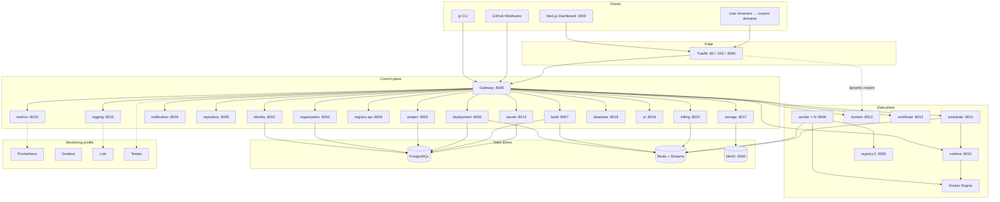
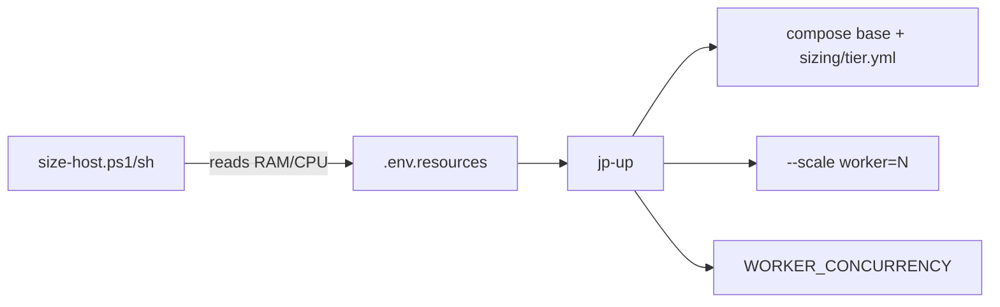
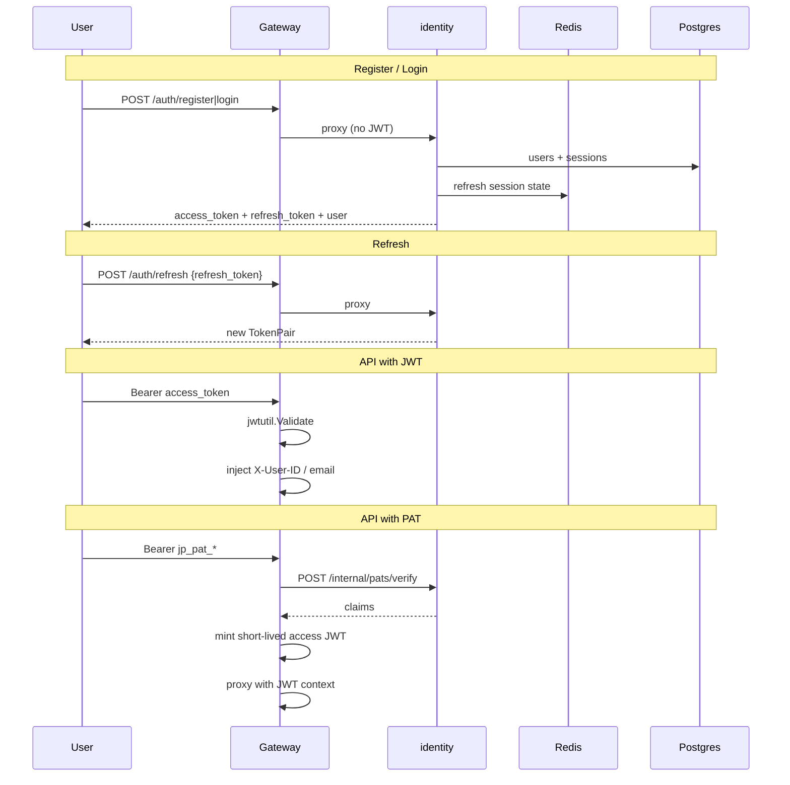
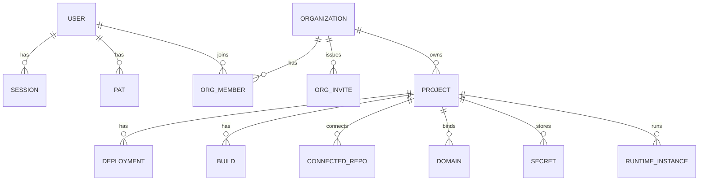
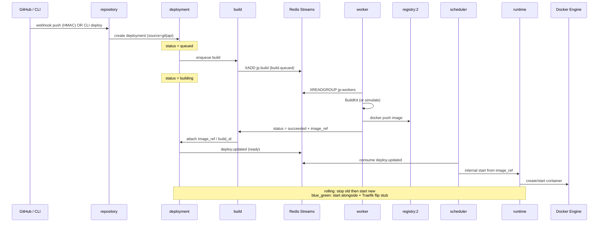
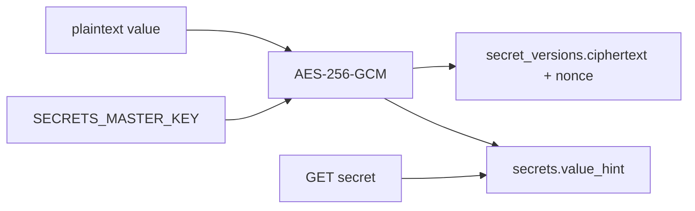
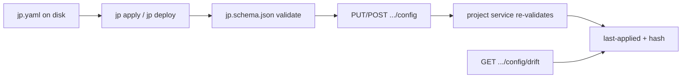
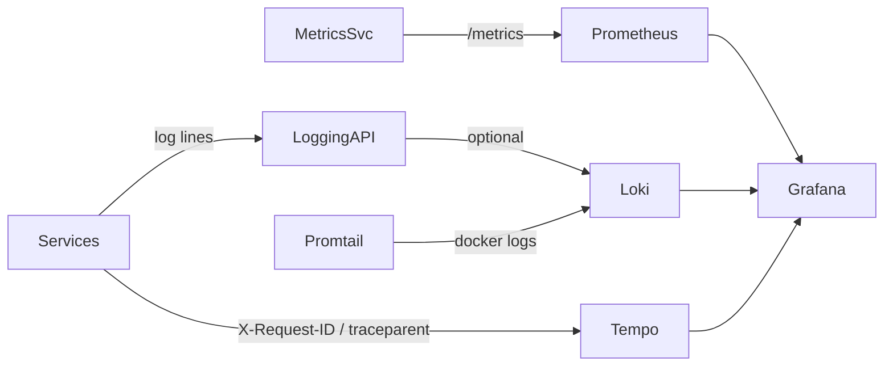
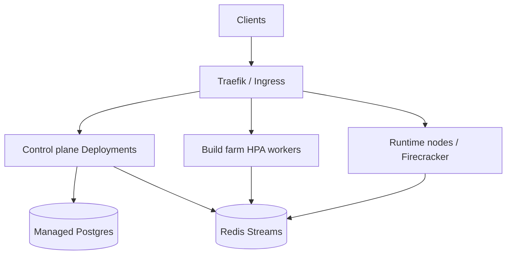
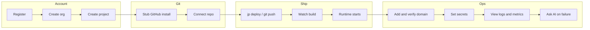

# jp Cloud Platform — Full Platform Reference

> Complete reference for architecture, features, endpoints, data models, flows, integrations, clients, ops, and roadmap.  
> Companion docs: [phases.md](phases.md) · [vps-runbook.md](vps-runbook.md) · [scale-out.md](scale-out.md) · [../packages/openapi/openapi.yaml](../packages/openapi/openapi.yaml)

**Brand / CLI:** `jp`  
**API base:** `http://localhost:8000/api/v1`  
**Auth:** `Authorization: Bearer <access_token | jp_pat_*>`  
**Status:** Phases **0–7 implemented**; Phase **8 documented only**

---

## Table of contents

1. [Product overview](#1-product-overview)
2. [System architecture](#2-system-architecture)
3. [Tech stack](#3-tech-stack)
4. [Monorepo layout](#4-monorepo-layout)
5. [Compose profiles & local endpoints](#5-compose-profiles--local-endpoints)
6. [Adaptive host sizing](#6-adaptive-host-sizing)
7. [Authentication & authorization](#7-authentication--authorization)
8. [Multi-tenancy model](#8-multi-tenancy-model)
9. [Event bus (Redis Streams)](#9-event-bus-redis-streams)
10. [End-to-end deploy pipeline](#10-end-to-end-deploy-pipeline)
11. [Deploy strategies](#11-deploy-strategies)
12. [Services catalog (every microservice)](#12-services-catalog-every-microservice)
13. [Complete API endpoint reference](#13-complete-api-endpoint-reference)
14. [OpenAPI schemas](#14-openapi-schemas)
15. [Database schemas](#15-database-schemas)
16. [jp.yaml IaC](#16-jpyaml-iac)
17. [Dashboard (Next.js)](#17-dashboard-nextjs)
18. [CLI (`jp`)](#18-cli-jp)
19. [Shared packages](#19-shared-packages)
20. [Infrastructure](#20-infrastructure)
21. [Scripts](#21-scripts)
22. [Environment variables](#22-environment-variables)
23. [Real vs simulate matrix](#23-real-vs-simulate-matrix)
24. [Integrations](#24-integrations)
25. [Observability](#25-observability)
26. [Security model](#26-security-model)
27. [Phase roadmap](#27-phase-roadmap)
28. [Operational runbook summary](#28-operational-runbook-summary)
29. [Glossary](#29-glossary)

---

## 1. Product overview

**jp** is a greenfield, self-hosted PaaS (Platform-as-a-Service) monorepo — conceptually similar to a mini **Heroku / Vercel / Railway**.

### What users can do

| Capability | Description |
|------------|-------------|
| Account | Register, login, refresh tokens, sessions, PATs |
| Tenancy | Organizations, invites, roles (`owner`/`admin`/`member`/`viewer`) |
| Projects | CRUD projects under an org |
| Git | Connect GitHub repos (stub App + mock/real repo list), receive webhooks |
| Deploy | Push-to-deploy or API/CLI deploy; rollback |
| Build | Docker BuildKit farm via Redis Streams workers |
| Registry | Push images to local OCI registry; metadata API |
| Runtime | Start/stop containers on Docker Engine |
| Domains | Custom domains, DNS verify, Traefik dynamic routes |
| TLS | Certificate metadata + optional ACME via Traefik |
| Secrets | AES-GCM encrypted env secrets per environment |
| Logs | Ingest/query build + runtime logs (optional Loki) |
| Metrics | Project summaries + Prometheus exposition |
| Storage | Per-project object buckets (MinIO) |
| Databases | One-click managed Postgres schemas |
| Cron | Schedules that enqueue runtime jobs |
| IaC | `jp.yaml` desired state, apply, drift stub |
| AI ops | Explain failures / ask (OpenAI or heuristic) |
| Billing | Plans (`free`/`pro`/`scale`) + usage event stubs |

### Clients

| Client | Path | Port / binary |
|--------|------|----------------|
| HTTP API | `services/gateway` | `:8000` |
| Web console | `apps/dashboard` | `:3000` |
| CLI | `apps/cli` | `jp` / `jp.exe` |

---

## 2. System architecture

### 2.1 High-level diagram



### 2.2 Request path (API)

```mermaid
sequenceDiagram
  participant C as Client (UI/CLI)
  participant T as Traefik
  participant G as Gateway
  participant O as organization
  participant S as Downstream service

  C->>T: HTTPS/HTTP /api/v1/...
  T->>G: PathPrefix(/api) → gateway
  G->>G: Validate JWT or jp_pat_*
  alt PAT
    G->>G: Verify PAT via identity; mint short JWT
  end
  alt Org-scoped route
    G->>O: GET /internal/orgs/{orgId}/members/{userId}
    O-->>G: role
    G->>G: Set X-User-ID, X-Org-ID, X-Org-Role
  end
  G->>S: Strip /api/v1 + proxy + headers
  S-->>G: JSON response
  G-->>C: JSON response
```

### 2.3 Layering

| Layer | Components |
|-------|------------|
| Edge | Traefik (file provider for gateway + per-domain routers) |
| API façade | `gateway` — auth, org context, reverse proxy |
| Control plane | identity, org, project, repo, deploy, build, secret, logging, metrics, storage, database, ai, billing, notification |
| Data plane | worker, runtime, scheduler, domain, certificate, OCI registry |
| Persistence | Shared Postgres (per-service schemas/tables), Redis Streams, MinIO |
| Observability | Prometheus, Grafana, Loki, Tempo, Promtail (optional) |

---

## 3. Tech stack

| Layer | Technology |
|-------|------------|
| Languages | Go **1.22** (services + CLI), TypeScript / React **19** (dashboard) |
| Workspace | `go.work` multi-module; no root npm workspace |
| HTTP | Go stdlib `ServeMux` (Go 1.22 patterns) |
| Frontend | Next.js **16.2**, Tailwind CSS **4** |
| CLI | Cobra (`github.com/spf13/cobra`) |
| DB | PostgreSQL **16** + `pgx/v5` |
| Cache / bus | Redis **7** Streams (`go-redis/v9`) |
| Auth crypto | JWT v5, bcrypt (`golang.org/x/crypto`) |
| Object storage | MinIO (`minio-go/v7`) |
| Builds | Docker BuildKit |
| Runtime | Docker Engine API / socket |
| Registry | Docker Distribution `registry:2` |
| Edge | Traefik **v3.2** |
| Contract | OpenAPI **3.0.3** |
| IaC schema | JSON Schema draft **2020-12** (`jp.yaml`) |
| Observability | Prometheus, Grafana, Loki, Tempo, Promtail; OTEL header propagation |

---

## 4. Monorepo layout

```
cloud-plateform/
├── apps/
│   ├── cli/                 # jp CLI (Cobra)
│   └── dashboard/           # Next.js console
├── services/                # Go microservices (ports 8000–8020)
│   ├── gateway/
│   ├── identity/
│   ├── organization/
│   ├── project/
│   ├── notification/
│   ├── repository/
│   ├── deployment/
│   ├── build/
│   ├── worker/
│   ├── registry/            # registry-api metadata
│   ├── runtime/
│   ├── scheduler/
│   ├── domain/
│   ├── certificate/
│   ├── secret/
│   ├── logging/
│   ├── metrics/
│   ├── storage/
│   ├── database/
│   ├── ai/
│   ├── billing/
│   └── event/               # stub README only (no Go module)
├── packages/
│   ├── go-common/           # shared Go libs
│   ├── events/              # Redis Streams envelope + topics
│   ├── openapi/             # OpenAPI 3 contract
│   └── jp-schema/           # jp.yaml JSON Schema
├── infra/
│   ├── compose/             # docker-compose + sizing overlays
│   ├── docker/              # Dockerfiles
│   ├── traefik/             # Traefik static + dynamic
│   └── monitoring/          # Prometheus/Loki/Tempo/Grafana/Promtail
├── scripts/                 # size-host, jp-up, go-real
├── docs/                    # this file + phases / runbook / scale-out
├── .env.example
├── docker-compose.yml       # includes infra/compose
├── go.work
└── README.md
```

### Typical service shape

```
services/<name>/
├── cmd/main.go              # boot: config → postgres → migrate → redis → HTTP
├── internal/handlers/       # HTTP handlers
├── internal/store/          # SQL access
├── internal/<feature>/      # optional: dockerx, crypto, llm, cron, …
├── migrations/*.sql
├── README.md
├── go.mod
└── go.sum
```

---

## 5. Compose profiles & local endpoints

### Profiles

| Profile | What starts |
|---------|-------------|
| *(default / core)* | traefik, gateway, identity, organization, project, notification, postgres, redis |
| `platform` | repository, deployment, build, worker, registry + registry-api, runtime, scheduler, domain, certificate, secret, logging, metrics, **ai**, **billing** |
| `ui` | dashboard (`:3000`) |
| `data` | MinIO, storage, database |
| `monitoring` | Prometheus, Grafana, Loki, Tempo, Promtail |
| `dev` | MailHog |

### Local URLs

| Endpoint | URL |
|----------|-----|
| Gateway health | http://localhost:8000/healthz |
| API base | http://localhost:8000/api/v1 |
| Traefik dashboard | http://localhost:8080 |
| Dashboard UI | http://localhost:3000 |
| Docker registry | http://localhost:5000 |
| MinIO API | http://localhost:9000 |
| MinIO console | http://localhost:9001 |
| Prometheus | http://localhost:9090 |
| Grafana | http://localhost:3001 (admin/admin) |
| Loki | http://localhost:3100 |
| Tempo | http://localhost:3200 |

### Service ports

| Service | Port | Service | Port |
|---------|------|---------|------|
| gateway | 8000 | identity | 8001 |
| organization | 8002 | project | 8003 |
| notification | 8004 | repository | 8005 |
| deployment | 8006 | build | 8007 |
| worker | 8008 | registry-api | 8009 |
| runtime | 8010 | scheduler | 8011 |
| domain | 8012 | certificate | 8013 |
| secret | 8014 | logging | 8015 |
| metrics | 8016 | storage | 8017 |
| database | 8018 | ai | 8019 |
| billing | 8020 | | |

---

## 6. Adaptive host sizing

**Philosophy:** 4GB RAM is the *small* demo tier — not a hard product limit. jp raises worker replicas, concurrency, and Compose mem/CPU limits with host size.

| Tier | Host RAM (auto) | Workers | Concurrent builds / worker | Suggested profiles |
|------|-----------------|---------|----------------------------|--------------------|
| **small** | &lt; 6 GB | 1 | 1 | core + platform (skip monitoring) |
| **medium** | 6–16 GB | 2 | 2 | platform + ui + data |
| **large** | 16–32 GB | 4 | 2 | + monitoring; real Docker builds |
| **xlarge** | 32 GB+ | 8 | 4 | full stack |

### Flow



Files: `scripts/size-host.*`, `scripts/jp-up.*`, `infra/compose/sizing/{small,medium,large,xlarge}.yml`

---

## 7. Authentication & authorization

### 7.1 Auth flows



### 7.2 Token types

| Type | Prefix / format | Lifetime (defaults) | Storage |
|------|-----------------|---------------------|---------|
| Access JWT | Bearer JWT | `JWT_ACCESS_TTL=15m` | Client memory / localStorage |
| Refresh JWT | Bearer JWT | `JWT_REFRESH_TTL=168h` | Client + Redis/session row |
| PAT | `jp_pat_*` | Until revoked | Hashed in `personal_access_tokens` |

### 7.3 Public (unauthenticated) routes

- `POST /api/v1/auth/register`
- `POST /api/v1/auth/login`
- `POST /api/v1/auth/refresh`
- `POST /api/v1/webhooks/github` (HMAC signature required)
- `GET /healthz`

### 7.4 Gateway headers injected downstream

| Header | Meaning |
|--------|---------|
| `X-User-ID` | Authenticated user UUID |
| `X-User-Email` | User email |
| `X-Org-ID` | Organization UUID (org-scoped routes) |
| `X-Org-Role` | `owner` \| `admin` \| `member` \| `viewer` |
| `X-Request-ID` / `X-Trace-ID` / `traceparent` | Observability propagation |

### 7.5 Roles

| Role | Typical powers |
|------|----------------|
| `owner` | Full control including invites / billing plan |
| `admin` | Manage members, projects, deploys |
| `member` | Operate projects (deploy, secrets, etc.) |
| `viewer` | Read-oriented access |

Invites (`POST .../invites`) typically require `owner` or `admin`.

---

## 8. Multi-tenancy model



- **User** — global identity
- **Organization** — tenancy boundary for billing, Git install, members
- **Project** — deployable unit; almost all APIs are `/orgs/{orgId}/projects/{projectId}/…`

---

## 9. Event bus (Redis Streams)

Defined in `packages/events`.

### Topics

| Topic constant | Stream name | Purpose |
|----------------|-------------|---------|
| `TopicAuth` | `jp.auth` | Auth lifecycle |
| `TopicOrg` | `jp.org` | Org/invite events |
| `TopicProject` | `jp.project` | Project CRUD |
| `TopicNotification` | `jp.notification` | Notification send |
| `TopicAudit` | `jp.audit` | Audit |
| `TopicDeploy` | `jp.deploy` | Deploy created/updated |
| `TopicBuild` | `jp.build` | Build queue + status |
| `TopicRuntime` | `jp.runtime` | Runtime start/stop/fail |
| `TopicDomain` | `jp.domain` | Domain/cert events |
| `TopicSecret` | `jp.secret` | Secret lifecycle |
| `TopicLogging` | `jp.logging` | Logging events |
| `TopicMetrics` | `jp.metrics` | Metrics events |
| `TopicStorage` | `jp.storage` | Storage upload/delete |
| `TopicDatabase` | `jp.database` | DB provision events |
| `TopicCleanup` | `jp.cleanup` | Orphan images / preview TTL |
| `TopicJobs` | `jp.jobs` | Cron-triggered jobs |

### Consumer groups

| Group | Stream(s) | Consumer |
|-------|-----------|----------|
| `jp-workers` | `jp.build` | build workers |
| `jp-scheduler` | `jp.deploy` | scheduler |
| `jp-cleanup` | `jp.cleanup` | cleanup loop |
| `jp-jobs` | `jp.jobs` | cron/job runner |
| `jp-billing` | `jp.build`, `jp.deploy` | billing metering |

### Envelope shape

```json
{
  "id": "<uuid>",
  "type": "deploy.updated",
  "topic": "jp.deploy",
  "timestamp": "2026-07-27T00:00:00Z",
  "actor_id": "<uuid>",
  "org_id": "<uuid>",
  "payload": {}
}
```

### Selected event types

`user.registered`, `user.logged_in`, `org.invite_created`, `project.created`, `repo.connected`, `git.push`, `deploy.created`, `deploy.updated`, `build.queued`, `build.started`, `build.succeeded`, `build.failed`, `runtime.started`, `runtime.stopped`, `domain.verified`, `cert.issued`, `secret.rotated`, `storage.uploaded`, `database.created`, `cleanup.orphaned_images`, `cleanup.preview_deploys`, `cron.triggered`, `job.queued`

---

## 10. End-to-end deploy pipeline



### Status machines

**Deployment:** `queued` → `building` → `ready` | `failed`  
**Build:** `queued` → `running` → `succeeded` | `failed`

### Rollback

- `POST .../deployments/rollback` → latest successful
- `POST .../deployments/{id}/rollback` → specific successful
- Creates a **new** deployment with `rollback_of` set; preserves/carries `strategy`

---

## 11. Deploy strategies

From `jp.yaml` `deploy.strategy` / deployment row:

| Strategy | Behavior (Phase 7) |
|----------|---------------------|
| `rolling` (default) | Stop previous instance, start new |
| `blue_green` | Start new alongside old; Traefik weight flip stub; drain previous |

Configured via `jp apply` / `jp deploy` reading local `jp.yaml`.

---

## 12. Services catalog (every microservice)

### 12.1 gateway (`:8000`)

| Item | Detail |
|------|--------|
| Entry | `services/gateway/cmd/main.go` |
| Proxy | `services/gateway/internal/proxy/proxy.go` |
| Role | Public `/api/v1` façade; JWT/PAT; org membership; CORS; otel headers; reverse proxy |
| Health | `GET /healthz` |

### 12.2 identity (`:8001`)

| Item | Detail |
|------|--------|
| Role | Users, password hash (bcrypt), JWT issue/validate, sessions, PATs, audit_logs |
| Key files | `internal/handlers`, `internal/store`, `migrations/identity_001_init.sql` |
| Tables | `users`, `sessions`, `personal_access_tokens`, `audit_logs` |

### 12.3 organization (`:8002`)

| Item | Detail |
|------|--------|
| Role | Orgs, members, invites, role checks; internal member lookup for gateway |
| Tables | `organizations`, `org_members`, `org_invites` |

### 12.4 project (`:8003`)

| Item | Detail |
|------|--------|
| Role | Project CRUD; store applied `jp.yaml` + hash; drift stub |
| Migrations | `project_001_init.sql`, `project_002_jp_config.sql` |

### 12.5 notification (`:8004`)

| Item | Detail |
|------|--------|
| Role | Accept/log invite emails; MailHog via `dev` profile |

### 12.6 repository (`:8005`)

| Item | Detail |
|------|--------|
| Role | GitHub App install (real when `GITHUB_APP_*` set, else stub); installation/PAT/mock repo list; connect/disconnect; webhook HMAC (`push` + PR previews); internal commit-status API |
| Tables | `github_installations`, `connected_repos` |

### 12.7 deployment (`:8006`)

| Item | Detail |
|------|--------|
| Role | Create/list/get deployments; webhook/API trigger; rollback; enqueue builds; publish deploy events; strategies |
| Status | `queued` → `building` → `ready` \| `failed` |
| Migrations | `deployment_001_init.sql`, `deployment_002_strategy.sql` |

### 12.8 build (`:8007`)

| Item | Detail |
|------|--------|
| Role | Build job records, status, logs API; XADD to `jp.build` |
| Table | `builds` |

### 12.9 worker (`:8008`)

| Item | Detail |
|------|--------|
| Role | Redis Streams consumer (`jp-workers`); BuildKit or simulate; push to registry; update build/deploy |
| Env | `WORKER_CONCURRENCY`, `WORKER_NAME`, `BUILD_MODE` |
| Scale | `--scale worker=N` / `WORKER_REPLICAS` |
| Key | `internal/worker/runner.go` |

### 12.10 registry / registry-api (`:8009` + `:5000`)

| Item | Detail |
|------|--------|
| registry-api | Image metadata CRUD (`images` table) |
| registry:2 | OCI registry daemon on host `:5000` |

### 12.11 runtime (`:8010`)

| Item | Detail |
|------|--------|
| Role | Desired-state instances (`static`/`node`/`container`); start/stop/list; Docker or simulate |
| Key | `internal/dockerx/dockerx.go` |
| Internal | `POST /internal/runtime/start` (scheduler) |
| Fallback | If Docker socket unreachable → simulate (`sim-*` ids) |

### 12.12 scheduler (`:8011`)

| Item | Detail |
|------|--------|
| Role | Single slot `node-1`; consume `deploy.updated` → start runtime; health/restart; rolling stub; cron API; cleanup; queues stub |
| Key | `internal/loop/loop.go`, `internal/cron/cron.go` |
| Env | `SCHEDULER_SLOT`, `CLEANUP_INTERVAL`, `PREVIEW_TTL`, `ORPHAN_IMAGE_TTL` |

### 12.13 domain (`:8012`)

| Item | Detail |
|------|--------|
| Role | Add/list/delete domains; TXT/CNAME verify or force / `DOMAIN_DNS_STUB`; write Traefik dynamic YAML |
| Key | `internal/dnscheck`, `internal/traefikcfg` |

### 12.14 certificate (`:8013`)

| Item | Detail |
|------|--------|
| Role | Cert status + renew metadata; Traefik ACME when `TRAEFIK_CERT_RESOLVER` set |
| Env | `CERT_SIMULATE` |

### 12.15 secret (`:8014`)

| Item | Detail |
|------|--------|
| Role | Environments; AES-256-GCM secrets; versioned ciphertext; never return plaintext after write (`value_hint` only); audit |
| Key | `internal/crypto/envelope.go` |
| Envs | `development`, `preview`, `staging`, `production` |
| Master key | `SECRETS_MASTER_KEY` (empty → fixed local key for demos) |

### 12.16 logging (`:8015`)

| Item | Detail |
|------|--------|
| Role | Ingest/query logs (Postgres); optional Loki push; can merge build-service logs for `source=build` |
| Table | `log_entries` |

### 12.17 metrics (`:8016`)

| Item | Detail |
|------|--------|
| Role | Project metric summary; Prometheus exposition; scrape targets |
| Env | `METRICS_MODE=live|simulate` |
| Tables | `metric_samples`, `scrape_targets` |

### 12.18 storage (`:8017`)

| Item | Detail |
|------|--------|
| Role | Ensure bucket; upload (base64); list; signed URL; delete |
| Modes | `STORAGE_MODE=minio|simulate` |
| Key | `internal/miniox` |
| Tables | `storage_buckets`, `storage_objects` |

### 12.19 database (`:8018`)

| Item | Detail |
|------|--------|
| Role | One-click managed DB; `DB_MODE=schema` creates schema+role on shared Postgres, or simulate; stores conn string via secret (`secret_ref`) |
| Key | `internal/provisioner` |
| Table | `managed_databases` |

### 12.20 ai (`:8019`)

| Item | Detail |
|------|--------|
| Role | Explain failed deploys/builds; ask; status; tools fetch build/runtime logs + deploy events |
| Modes | OpenAI if `OPENAI_API_KEY`; else heuristic simulate |
| Key | `internal/llm/llm.go` |
| Env | `AI_BASE_URL`, `AI_MODEL` (default `gpt-4o-mini`) |

### 12.21 billing (`:8020`)

| Item | Detail |
|------|--------|
| Role | Plans `free`/`pro`/`scale`; usage meters stubs (`build_minutes`, `runtime_hours`); consume build/deploy streams |
| Key | `internal/consumer`, `internal/handlers` |
| Tables | `billing_usage_events`, `billing_org_plans` |
| Note | **No Stripe / payment processor** |

### 12.22 event (stub)

`services/event/README.md` only — real event code lives in `packages/events`.

---

## 13. Complete API endpoint reference

Base: **`/api/v1`**. Unless noted, requires Bearer auth.

### 13.1 Auth

| Method | Path | Auth | Summary |
|--------|------|------|---------|
| POST | `/auth/register` | — | Register `{email,password,name}` → AuthResponse |
| POST | `/auth/login` | — | Login → AuthResponse |
| POST | `/auth/refresh` | — | `{refresh_token}` → TokenPair |
| POST | `/auth/logout` | ✓ | Logout current session |
| GET | `/auth/me` | ✓ | Current user |
| GET | `/auth/sessions` | ✓ | List sessions |
| DELETE | `/auth/sessions/{id}` | ✓ | Revoke session |
| GET | `/auth/pats` | ✓ | List PATs (no raw token) |
| POST | `/auth/pats` | ✓ | Create PAT `{name,scopes?}` — token shown once |
| DELETE | `/auth/pats/{id}` | ✓ | Revoke PAT |

### 13.2 Organizations

| Method | Path | Summary |
|--------|------|---------|
| GET | `/orgs` | List orgs for user |
| POST | `/orgs` | Create `{name,slug}` |
| GET | `/orgs/{orgId}` | Get org |
| POST | `/orgs/{orgId}/invites` | Invite `{email,role}` |
| POST | `/orgs/invites/accept` | Accept `{token}` |
| GET | `/orgs/{orgId}/members` | List members |

### 13.3 Projects

| Method | Path | Summary |
|--------|------|---------|
| GET | `/orgs/{orgId}/projects` | List |
| POST | `/orgs/{orgId}/projects` | Create `{name,slug,description?}` |
| GET | `/orgs/{orgId}/projects/{projectId}` | Get |
| PATCH | `/orgs/{orgId}/projects/{projectId}` | Update |
| DELETE | `/orgs/{orgId}/projects/{projectId}` | Delete |

### 13.4 Git

| Method | Path | Summary |
|--------|------|---------|
| POST | `/orgs/{orgId}/github/install/start` | Start GitHub App install (real or stub) |
| POST | `/orgs/{orgId}/github/install/callback` | Complete install |
| GET | `/github/setup` | App setup redirect (public) |
| POST | `/orgs/{orgId}/github/install/callback` | Complete install stub |
| GET | `/orgs/{orgId}/github/installations` | List installations |
| GET | `/orgs/{orgId}/github/repos` | Available repos (mock or GitHub API) |
| GET | `/orgs/{orgId}/projects/{projectId}/repos` | Connected repos |
| POST | `/orgs/{orgId}/projects/{projectId}/repos` | Connect `{full_name,clone_url?,default_branch?,installation_id?}` |
| DELETE | `/orgs/{orgId}/projects/{projectId}/repos/{repoId}` | Disconnect |
| POST | `/webhooks/github` | **Public**; HMAC `X-Hub-Signature-256` |

### 13.5 Deployments

| Method | Path | Summary |
|--------|------|---------|
| GET | `.../deployments` | List |
| POST | `.../deployments` | Create (queues build); body: git_sha, branch, clone_url, … |
| GET | `.../deployments/{deploymentId}` | Get one |
| POST | `.../deployments/rollback` | Rollback to latest successful |
| POST | `.../deployments/{deploymentId}/rollback` | Rollback to specific |

### 13.6 Builds & images

| Method | Path | Summary |
|--------|------|---------|
| GET | `.../builds` | List builds |
| GET | `.../builds/{buildId}` | Get build |
| GET | `.../builds/{buildId}/logs` | Build logs |
| GET | `.../images` | Image metadata list |

### 13.7 Runtime

| Method | Path | Summary |
|--------|------|---------|
| GET | `.../runtime/instances` | List instances |
| POST | `.../runtime/instances` | Create instance |
| GET | `.../runtime/instances/{instanceId}` | Get |
| POST | `.../runtime/instances/{instanceId}/start` | Start |
| POST | `.../runtime/instances/{instanceId}/stop` | Stop |
| GET | `.../runtime/containers` | List containers |

### 13.8 Domains

| Method | Path | Summary |
|--------|------|---------|
| GET | `.../domains` | List |
| POST | `.../domains` | Add hostname |
| GET | `.../domains/{domainId}` | Get |
| POST | `.../domains/{domainId}/verify` | Verify DNS (`force` supported) |
| DELETE | `.../domains/{domainId}` | Delete |

### 13.9 Certificates

| Method | Path | Summary |
|--------|------|---------|
| GET | `.../certificates` | List |
| GET | `.../certificates/{certId}` | Get |
| POST | `.../certificates/{certId}/renew` | Renew / refresh metadata |

### 13.10 Environments & secrets

Environments enum: `development` | `preview` | `staging` | `production`

| Method | Path | Summary |
|--------|------|---------|
| GET | `.../environments` | List envs |
| POST | `.../environments` | Create env |
| GET | `.../environments/{env}/secrets` | List secret metas (hints) |
| POST | `.../environments/{env}/secrets` | Create secret |
| GET | `.../environments/{env}/secrets/{name}` | Get meta (no plaintext) |
| PUT | `.../environments/{env}/secrets/{name}` | Rotate |
| DELETE | `.../environments/{env}/secrets/{name}` | Delete |
| GET | `.../env/{env}` | Convenience: list env vars |
| PUT | `.../env/{env}/{name}` | Convenience: set |
| DELETE | `.../env/{env}/{name}` | Convenience: unset |

### 13.11 Logs

| Method | Path | Summary |
|--------|------|---------|
| GET | `.../logs` | Query logs |
| POST | `.../logs` | Write/query helper |
| POST | `.../logs/ingest` | Bulk ingest |

### 13.12 Metrics

| Method | Path | Summary |
|--------|------|---------|
| GET | `.../metrics` | Project summary |
| POST | `.../metrics` | Push samples |
| GET | `.../metrics/targets` | Scrape targets |
| POST | `.../metrics/targets` | Register target |

### 13.13 Storage

| Method | Path | Summary |
|--------|------|---------|
| GET | `.../storage/bucket` | Get/ensure bucket |
| POST | `.../storage/bucket` | Create bucket |
| GET | `.../storage/objects` | List objects |
| POST | `.../storage/objects` | Upload `{key, data_base64}` |
| POST | `.../storage/signed-url` | `{key, expires?}` |
| DELETE | `.../storage/objects?key=` | Delete object |

### 13.14 Databases

| Method | Path | Summary |
|--------|------|---------|
| GET | `.../databases` | List managed DBs |
| POST | `.../databases` | Provision |
| GET | `.../databases/{dbId}` | Get |
| DELETE | `.../databases/{dbId}` | Delete |

### 13.15 Cron & queues

| Method | Path | Summary |
|--------|------|---------|
| GET | `.../cron` | List schedules |
| POST | `.../cron` | Create (`@hourly`, `@every 5m`, …) |
| DELETE | `.../cron/{cronId}` | Delete |
| GET | `.../queues` | Platform queue stub |

### 13.16 Config (jp.yaml)

| Method | Path | Summary |
|--------|------|---------|
| PUT | `.../config` | Apply desired state |
| POST | `.../config` | Apply (alias) |
| GET | `.../config` | Get last-applied |
| GET | `.../config/drift` | Drift stub |

### 13.17 AI

| Method | Path | Summary |
|--------|------|---------|
| POST | `.../projects/{projectId}/ai/explain` | Explain failure from logs/events |
| POST | `/orgs/{orgId}/ai/ask` | Free-form ask |
| GET | `/orgs/{orgId}/ai/status` | Mode / readiness |

### 13.18 Billing

| Method | Path | Summary |
|--------|------|---------|
| GET | `/billing/plans` | Global plan catalog |
| GET | `/orgs/{orgId}/billing/plans` | Plans (org context) |
| GET | `/orgs/{orgId}/billing/usage` | Usage summary |
| GET | `/orgs/{orgId}/billing/events` | Usage events |
| POST | `/orgs/{orgId}/billing/events` | Record event |
| GET | `/orgs/{orgId}/billing/plan` | Current plan |
| PUT | `/orgs/{orgId}/billing/plan` | Set plan |

### 13.19 Health

| Method | Path | Auth | Summary |
|--------|------|------|---------|
| GET | `/healthz` | — | Gateway liveness |

Canonical machine-readable contract: [`packages/openapi/openapi.yaml`](../packages/openapi/openapi.yaml).

---

## 14. OpenAPI schemas

| Schema | Key fields |
|--------|------------|
| `Error` | `error.code`, `error.message` |
| `User` | `id`, `email`, `name`, `created_at` |
| `TokenPair` | `access_token`, `refresh_token` |
| `AuthResponse` | TokenPair + `user` |
| `Session` | `id`, `user_agent`, `ip`, `created_at`, `expires_at` |
| `PAT` | `id`, `name`, `token_prefix`, `scopes`, `last_used_at` |
| `PATCreated` | PAT + `token` (once) |
| `Org` | `id`, `name`, `slug`, `role`, `created_at` |
| `Invite` | `id`, `email`, `role`, `token`, `expires_at` |
| `Member` | `user_id`, `email`, `name`, `role`, `joined_at` |
| `Project` | `id`, `org_id`, `name`, `slug`, `description`, timestamps |
| `Deployment` | `status` ∈ queued/building/ready/failed, `git_*`, `image_ref`, `build_id`, `rollback_of` |
| `Build` | `status` ∈ queued/running/succeeded/failed, `framework`, `image_ref`, `logs` |
| `RuntimeInstance` | `kind`, `image_ref`, `status`, `desired_state`, `mode` ∈ simulate/docker, `health_status`, `container_id` |
| `Domain` | `hostname`, `status`, `verification_type`, `certificate_id` |
| `Certificate` | `hostname`, `status`, `provider`, `expires_at`, `renewed_at` |

Path params: `orgId`, `projectId` (UUID); `env` enum as above.

---

## 15. Database schemas

Shared database name: **`jp`** (Compose). Each service owns tables via SQL migrations on boot.

| Migration | Tables |
|-----------|--------|
| `identity_001_init.sql` | `users`, `sessions`, `personal_access_tokens`, `audit_logs` |
| `organization_001_init.sql` | `organizations`, `org_members`, `org_invites` |
| `project_001_init.sql` | `projects` |
| `project_002_jp_config.sql` | jp config columns / hash / applied_at |
| `repository_001_init.sql` | `github_installations`, `connected_repos` |
| `deployment_001_init.sql` | `deployments` |
| `deployment_002_strategy.sql` | `strategy`, related jp_config fields |
| `build_001_init.sql` | `builds` |
| `registry_001_init.sql` | `images` |
| `runtime_001_init.sql` | `runtime_instances` |
| `scheduler_001_init.sql` | placeholder (cron often Redis/in-memory) |
| `domain_001_init.sql` | `domains` |
| `certificate_001_init.sql` | `certificates` |
| `secret_001_init.sql` | `project_environments`, `secrets`, `secret_versions`, `secret_audit` |
| `logging_001_init.sql` | `log_entries` |
| `metrics_001_init.sql` | `metric_samples`, `scrape_targets` |
| `storage_001_init.sql` | `storage_buckets`, `storage_objects` |
| `database_001_init.sql` | `managed_databases` |
| `billing_001_init.sql` | `billing_usage_events`, `billing_org_plans` |

### Secrets encryption detail



---

## 16. jp.yaml IaC

Schema: [`packages/jp-schema/jp.schema.json`](../packages/jp-schema/jp.schema.json)

### Example

```yaml
name: my-app
description: Demo app
runtime: nodejs   # nodejs | python | go | docker | static | node | node22
build:
  command: npm run build
  dockerfile: Dockerfile
  context: .
deploy:
  region: local
  replicas: 1
  port: 3000
  strategy: rolling   # or blue_green
  healthcheck: /healthz
  env:
    NODE_ENV: production
domains:
  - app.example.com
env:
  LOG_LEVEL: info
```

### Validation & apply path



CLI: `jp init`, `jp apply`, `jp apply drift`, `jp deploy` (reads yaml when present).

---

## 17. Dashboard (Next.js)

**Path:** `apps/dashboard`  
**Stack:** Next.js 16 App Router, React 19, Tailwind 4  
**API client:** `src/lib/api.ts` (auto refresh on 401)  
**Tokens:** `localStorage` via `src/lib/storage.ts`

### Routes

| Route | Page | Feature |
|-------|------|---------|
| `/` | `page.tsx` | Landing / redirect |
| `/login` | `login/page.tsx` | Login |
| `/register` | `register/page.tsx` | Register |
| `/projects` | `(console)/projects/page.tsx` | Project list |
| `/projects/new` | `projects/new/page.tsx` | Create project |
| `/projects/[projectId]` | `projects/[projectId]/page.tsx` | Project detail / config |
| `/git` | `git/page.tsx` | Connect Git |
| `/deployments` | `deployments/page.tsx` | Deploys + rollback |
| `/builds` | `builds/page.tsx` | Builds / logs |
| `/runtime` | `runtime/page.tsx` | Instances |
| `/domains` | `domains/page.tsx` | Domains + verify |
| `/secrets` | `secrets/page.tsx` | Secrets / envs |
| `/logs` | `logs/page.tsx` | Log viewer |
| `/metrics` | `metrics/page.tsx` | Metrics |
| `/storage` | `storage/page.tsx` | Buckets / objects |
| `/databases` | `databases/page.tsx` | Managed DBs |
| `/billing` | `billing/page.tsx` | Plans / usage |
| `/ai` | `ai/page.tsx` | Explain / ask |
| `/team` | `team/page.tsx` | Members / invites |
| `/keys` | `keys/page.tsx` | PATs |
| `/sessions` | `sessions/page.tsx` | Sessions |
| `/orgs/new` | `orgs/new/page.tsx` | Create org |
| `/invite/accept` | `invite/accept/page.tsx` | Accept invite |

### Key components / libs

| File | Role |
|------|------|
| `components/app-shell.tsx` | Sidebar nav + org switcher |
| `components/require-auth.tsx` | Auth gate |
| `components/providers.tsx` | Context providers |
| `components/brand.tsx` | Brand mark |
| `lib/auth-context.tsx` | Auth state |
| `lib/org-context.tsx` | Current org |
| `lib/types.ts` | TS types |
| `lib/api.ts` | Full gateway client |

Env: `NEXT_PUBLIC_API_URL` (default `http://localhost:8000/api/v1`).

---

## 18. CLI (`jp`)

**Build:** `cd apps/cli && go build -o jp.exe .`  
**Config:** `~/.jp/config.json` (override dir: `JP_CONFIG_DIR`)

### Config fields

| Field | Description |
|-------|-------------|
| `access_token` | Bearer access |
| `refresh_token` | Refresh |
| `api_url` | Default `http://localhost:8000/api/v1` |
| `current_org_id` | Active org |

### Commands

| Command | Description |
|---------|-------------|
| `jp login` | Email/password interactive |
| `jp login --token <pat>` | PAT login |
| `jp logout` | Clear credentials |
| `jp whoami` | Current user |
| `jp orgs` | List orgs |
| `jp org use <slug\|id>` | Set current org |
| `jp projects` | List projects |
| `jp init [name]` | Scaffold `jp.yaml` |
| `jp apply` | Validate + apply `jp.yaml` |
| `jp apply drift` / `jp drift` | Config drift stub |
| `jp deploy --project <id>` | Deploy (reads yaml) |
| `jp status --project <id>` | Deployments + runtime |
| `jp builds --project <id>` | List builds |
| `jp rollback [id] --project <id>` | Rollback |
| `jp domains list\|add\|verify\|delete` | Domains |
| `jp secrets list\|set\|unset` | Secrets |
| `jp env list\|set\|unset` | Env vars |
| `jp logs --project <id> --source runtime` | Logs |
| `jp metrics --project <id>` | Metrics |
| `jp storage bucket\|ls\|put\|sign\|rm` | Object storage |
| `jp db list\|create\|delete` | Managed databases |
| `jp ai "…" --project <id>` | AI ops |
| `jp config get\|set` | CLI config |

---

## 19. Shared packages

### `packages/go-common`

| Package | File | Role |
|---------|------|------|
| config | `config/config.go` | Env-based config |
| postgres | `postgres/postgres.go` | pgx pool + migrate SQL files |
| redis | `redis/redis.go` | Redis client |
| jwt | `jwt/jwt.go` | Access/refresh manager |
| httpx | `httpx/httpx.go` | JSON + error contract |
| middleware | `middleware/middleware.go` | CORS, logging, bearer, request ID |
| logging | `logging/logging.go` | slog JSON |
| audit | `audit/audit.go` | Audit writer |
| otelx | `otelx/otelx.go` | Trace/request propagation |
| jpconfig | `jpconfig/jpconfig.go` | jp.yaml helpers |

### `packages/events`

Envelope, topics, event types, consumer group names, Streams helpers (`streams.go`).

### `packages/openapi`

Full public API OpenAPI 3 document.

### `packages/jp-schema`

`jp.schema.json` for manifest validation.

---

## 20. Infrastructure

### Compose

- `infra/compose/docker-compose.yml` — canonical stack + profiles
- `infra/compose/sizing/*.yml` — resource overlays
- Root `docker-compose.yml` — includes infra compose

### Docker images

| File | Role |
|------|------|
| `infra/docker/Dockerfile.service` | Multi-stage Go microservice |
| `infra/docker/Dockerfile.worker` | Worker with Docker sock access |
| `apps/dashboard/Dockerfile` | Next.js UI image |

### Traefik

| File | Role |
|------|------|
| `infra/traefik/traefik.yml` | Static config |
| `infra/traefik/dynamic.yml` | Dynamic provider entry |
| `infra/traefik/dynamic/gateway.yml` | `/api` → gateway |
| Written at runtime by domain service | Per-hostname routers |

### Monitoring configs

| File | Role |
|------|------|
| `infra/monitoring/prometheus.yml` | Scrape targets |
| `infra/monitoring/loki-config.yml` | Loki |
| `infra/monitoring/tempo.yml` | Tempo OTLP |
| `infra/monitoring/promtail-config.yml` | Log shipper |
| `infra/monitoring/grafana/datasources.yml` | Grafana datasources |

---

## 21. Scripts

| Script | Role |
|--------|------|
| `scripts/size-host.ps1` / `.sh` | Detect RAM/CPU → write `.env.resources` |
| `scripts/jp-up.ps1` / `.sh` | Merge sizing + compose up + scale workers |
| `scripts/go-real.ps1` / `.sh` | Force real (non-simulate) mode env values |

### Quickstart (Windows)

```powershell
Copy-Item .env.example .env
.\scripts\size-host.ps1
.\scripts\jp-up.ps1 -Profiles platform,ui
# optional:
.\scripts\jp-up.ps1 -Size large -Profiles platform,ui,data,monitoring
```

### Quickstart (Unix)

```bash
cp .env.example .env
./scripts/size-host.sh
./scripts/jp-up.sh platform,ui
```

---

## 22. Environment variables

See [`.env.example`](../.env.example) for the full template. Groups:

| Group | Examples |
|-------|----------|
| Core | `JP_ENV`, `JP_LOG_LEVEL`, `JWT_SECRET`, `JWT_ACCESS_TTL`, `JWT_REFRESH_TTL` |
| Postgres | `POSTGRES_USER`, `POSTGRES_PASSWORD`, `POSTGRES_DB`, `DATABASE_URL` |
| Redis | `REDIS_URL` |
| Service URLs | `IDENTITY_URL` … `BILLING_URL`, `GATEWAY_URL` |
| Public | `PUBLIC_BASE_URL`, `CORS_ORIGINS` |
| GitHub | `GITHUB_WEBHOOK_SECRET`, `GITHUB_TOKEN` |
| Modes | `BUILD_MODE`, `RUNTIME_MODE`, `DOMAIN_DNS_STUB`, `CERT_SIMULATE`, `METRICS_MODE`, `STORAGE_MODE`, `DB_MODE` |
| Registry | `REGISTRY_PUSH_URL`, `REGISTRY_HOST` |
| Scheduler | `SCHEDULER_SLOT`, `CLEANUP_INTERVAL`, `PREVIEW_TTL`, `ORPHAN_IMAGE_TTL` |
| Secrets | `SECRETS_MASTER_KEY` |
| Monitoring | `LOKI_URL`, `PROMETHEUS_URL`, `OTEL_EXPORTER_OTLP_ENDPOINT`, Grafana admin |
| MinIO | `MINIO_ROOT_USER`, `MINIO_ROOT_PASSWORD`, `MINIO_ENDPOINT`, `MINIO_PUBLIC_URL` |
| AI | `OPENAI_API_KEY`, `AI_BASE_URL`, `AI_MODEL` |
| Sizing | `JP_SIZE`, `WORKER_REPLICAS`, `WORKER_CONCURRENCY` |
| Ports | `GATEWAY_PORT` … `BILLING_PORT`, MinIO ports |

---

## 23. Real vs simulate matrix

| Piece | Real | Simulate / stub |
|-------|------|-----------------|
| GitHub App install | **Real** with `GITHUB_APP_*` | Stub when unset |
| Repo list | Installation token / `GITHUB_TOKEN` | Mock list |
| Webhooks | HMAC verified (`push` + `pull_request`) | — |
| Commit statuses | App installation token via repository | No-op without App |
| Preview deploys | PR + non-default branch webhooks | TTL cleanup heuristics |
| Builds | `BUILD_MODE=docker` BuildKit | Fake success logs |
| Image push | Host Docker → `:5000` | Skipped / fake ref |
| Runtime | `RUNTIME_MODE=docker` | `sim-*` containers |
| Domain DNS | Live TXT/CNAME | `DOMAIN_DNS_STUB` / `--force` |
| Certificates | Traefik ACME | Metadata only (`CERT_SIMULATE`) |
| Secrets | AES-GCM | Same crypto; demo master key |
| Logs | Postgres (+ Loki optional) | — |
| Metrics | `live` | Seeded series |
| Storage | MinIO | In-process stub |
| Databases | Schema+role on Postgres | Fake connection strings |
| AI | OpenAI API | Heuristic from logs |
| Billing | Stream metering | Usage numbers are stubs; no payments |

Force real defaults: `scripts/go-real.*`

---

## 24. Integrations

| Integration | Purpose | Status |
|-------------|---------|--------|
| GitHub | Repos + webhooks | OAuth/App stub; webhooks real; token optional |
| Docker Engine | Build + run | Real by default |
| Docker Registry | Image storage | Real (`registry:2`) |
| MinIO | S3 objects | Real with `data` profile |
| PostgreSQL | Platform + managed app schemas | Real |
| Redis Streams | Queues / events | Real |
| Traefik | Edge + dynamic domains | Real |
| Let's Encrypt | TLS | Optional via ACME resolver |
| OpenAI | AI explain/ask | Optional |
| Prometheus/Grafana/Loki/Tempo | Observability | Optional profile |
| MailHog | Dev email | `dev` profile |
| Stripe / payments | — | **Not implemented** |

---

## 25. Observability



- Gateway chains `otelx.Propagate` + logging + CORS middleware.
- Set `OTEL_EXPORTER_OTLP_ENDPOINT=http://tempo:4318` when monitoring profile is up.
- Grafana default: `admin` / `admin` on `:3001`.

---

## 26. Security model

| Area | Mechanism |
|------|-----------|
| Transport (prod) | Terminate TLS at Traefik / reverse proxy |
| API auth | JWT access + refresh; PATs hashed at rest |
| Passwords | bcrypt |
| Org isolation | Gateway membership check before project routes |
| Webhooks | HMAC SHA-256 (`GITHUB_WEBHOOK_SECRET`) |
| Secrets | AES-256-GCM; plaintext never re-read via API |
| CORS | `CORS_ORIGINS` allowlist |
| Audit | identity `audit_logs` + secret_audit |
| Secrets in repo | `.env` gitignored; use `.env.example` only |

**Do not commit** real `JWT_SECRET`, DB passwords, `SECRETS_MASTER_KEY`, or `OPENAI_API_KEY`.

---

## 27. Phase roadmap

| Phase | Scope | Status |
|-------|--------|--------|
| **0** | Monorepo, packages, Compose, Traefik, sizing | ✅ |
| **1** | Auth, orgs, projects, PATs, gateway, notifications | ✅ |
| **2** | Git, webhooks, deployments, rollback, UI/CLI | ✅ |
| **3** | Build farm, worker, registry | ✅ |
| **4** | Runtime, scheduler, domains, certificates | ✅ |
| **5** | Secrets, logs, metrics, optional monitoring stack | ✅ |
| **6** | Storage, databases, cron, cleanup queues | ✅ |
| **7** | jp.yaml, strategies, AI, billing | ✅ |
| **8** | Multi-node / K8s / Firecracker | 📄 docs only ([scale-out.md](scale-out.md)) |

### Phase 8 target (documented)



Non-goals today: full Helm charts, hard multi-tenant isolation, Kafka.

---

## 28. Operational runbook summary

Full detail: [vps-runbook.md](vps-runbook.md).

1. Install Docker Engine / Desktop.
2. Copy `.env.example` → `.env`; set strong `JWT_SECRET` / `POSTGRES_PASSWORD`.
3. Run `size-host` then `jp-up` with desired profiles.
4. Verify `curl http://127.0.0.1:8000/healthz`.
5. Open dashboard `:3000` or use `jp login`.

### Backups

| Volume / data | Guidance |
|---------------|----------|
| Postgres `postgres_data` | Nightly `pg_dump` |
| Redis | Cache/sessions — loss forces re-login |
| MinIO volume | Backup if storing production artifacts |

### Upgrades

Pull images with same compose + sizing files, then `jp-up` again.

---

## 29. Glossary

| Term | Meaning |
|------|---------|
| **jp** | Brand and CLI name |
| **Gateway** | Public API reverse proxy with auth |
| **Org** | Multi-tenant organization |
| **Project** | Deployable application unit |
| **PAT** | Personal access token (`jp_pat_*`) |
| **jp.yaml** | Project desired-state manifest |
| **Worker** | Build farm consumer process |
| **Slot** | Scheduler placement key (today `node-1`) |
| **Rolling** | Replace-in-place deploy strategy |
| **Blue/green** | Dual instance + flip stub |
| **Simulate mode** | In-process fake for Docker/DNS/AI/storage/etc. |
| **Sizing tier** | small/medium/large/xlarge host profile |

---

## Appendix A — Feature ↔ surface matrix

| Feature | API | Dashboard | CLI | Service(s) |
|---------|-----|-----------|-----|------------|
| Auth / sessions / PATs | ✓ | ✓ | ✓ | identity |
| Orgs / team / invites | ✓ | ✓ | ✓ | organization, notification |
| Projects | ✓ | ✓ | ✓ | project |
| jp.yaml config / drift | ✓ | ✓ | ✓ | project |
| Git connect / webhooks | ✓ | ✓ | via deploy | repository |
| Deployments / rollback | ✓ | ✓ | ✓ | deployment |
| Builds / logs | ✓ | ✓ | ✓ | build, worker |
| Images | ✓ | via builds | — | registry |
| Runtime | ✓ | ✓ | status | runtime, scheduler |
| Domains / certs | ✓ | ✓ | domains | domain, certificate |
| Secrets / env | ✓ | ✓ | ✓ | secret |
| Logs / metrics | ✓ | ✓ | ✓ | logging, metrics |
| Storage | ✓ | ✓ | ✓ | storage (+ MinIO) |
| Databases | ✓ | ✓ | ✓ | database |
| Cron / queues | ✓ | — | — | scheduler |
| AI | ✓ | ✓ | ✓ | ai |
| Billing | ✓ | ✓ | — | billing |

---

## Appendix B — User journey (happy path)



---

## Appendix C — Related source of truth

| Concern | Canonical file |
|---------|----------------|
| Public API | `packages/openapi/openapi.yaml` |
| Phase status | `docs/phases.md` |
| Host ops | `docs/vps-runbook.md` |
| Scale-out | `docs/scale-out.md` |
| Env template | `.env.example` |
| Gateway routes | `services/gateway/cmd/main.go` |
| Events | `packages/events/events.go` |
| jp.yaml schema | `packages/jp-schema/jp.schema.json` |
| Product overview | `README.md` |

---

*Generated as the exhaustive platform reference for the jp Cloud Platform monorepo (Phases 0–7).*
